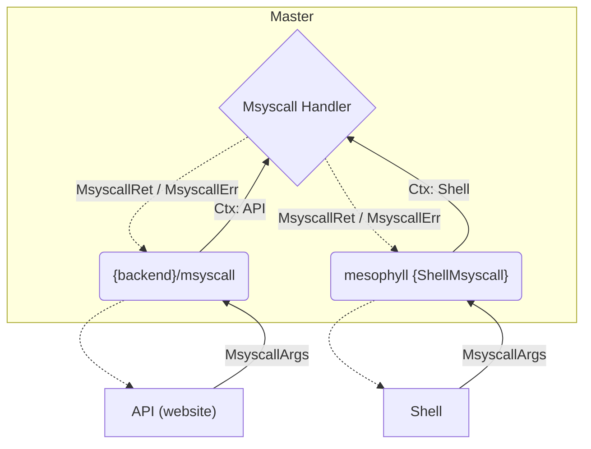

# MSyscall

MSyscall's or (Master) system calls provide a common APIs for template-worker master process as well as any external tooling running on top of ``template-worker``.

## Basic working

### User View

## Other Notes

### API Oauth vs Token 

If msyscall is accessed through the API via a login token (created using Discord Oauth2), the following additional endpoints are available:

- ``Discord.GetUserGuilds`` (msyscall does not currently handle refresh tokens well)